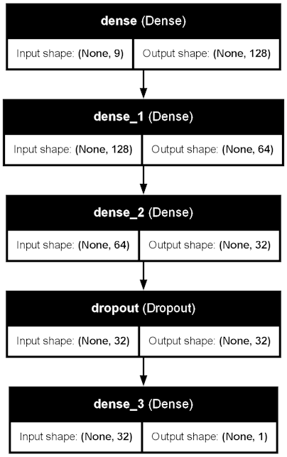

# AQI Predicting Model

* Analyzed the data of an array of 5 metal oxide chemical sensors embedded in an Air Quality Chemical Multisensor Device located in an Italian City
* use the Ground Truth hourly averaged concentrations for CO, Non Metanic Hydrocarbons, Benzene, Total Nitrogen Oxides (NOx) and Nitrogen Dioxide (NO2) in order to calculate the AQI at given time
* Imputed the Missing values using grouping by most relevant features
* Trained a Regression Model based on the data and obtained an accuracy of 87.1% with a rather simple model.

Created for [The Dataverse Competition conducted by IIT Roorkee](https://unstop.com/hackathons/dataversewest-bengal-zonals-cognizance-iit-roorkee-1291530)